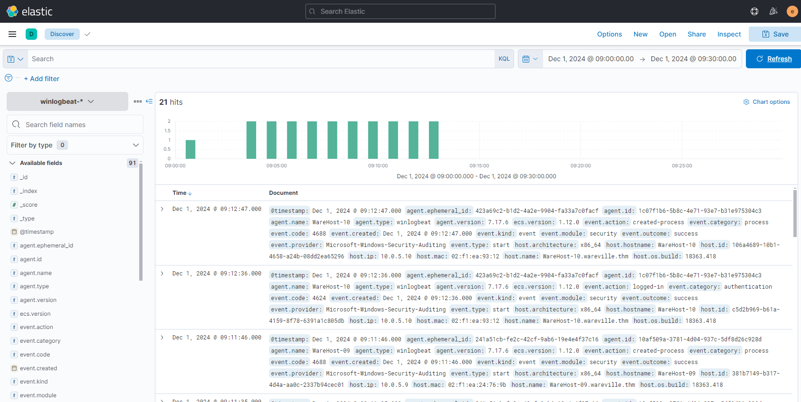
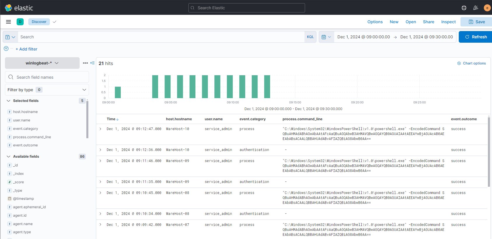
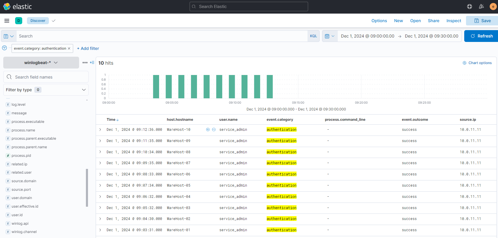
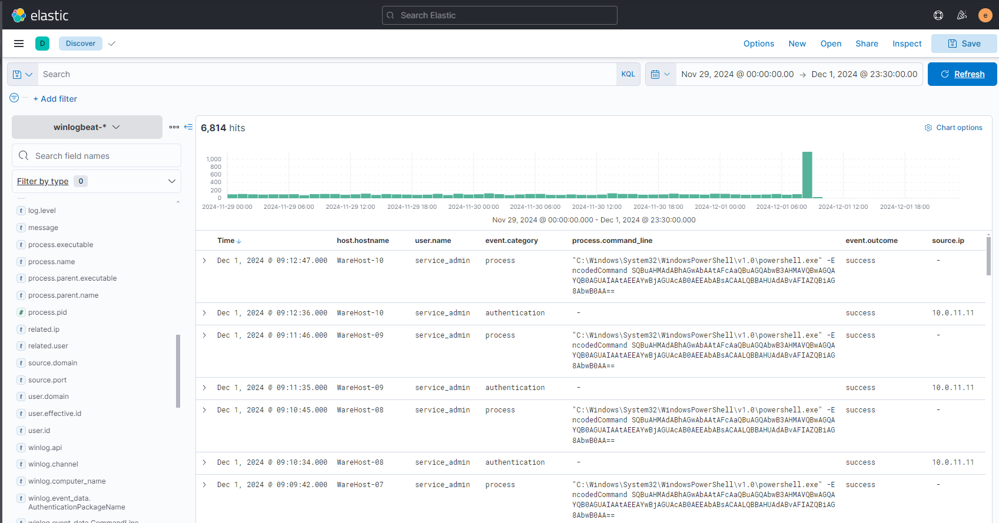
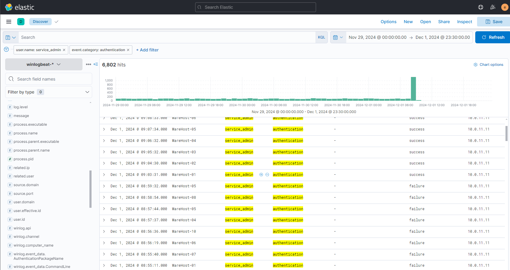
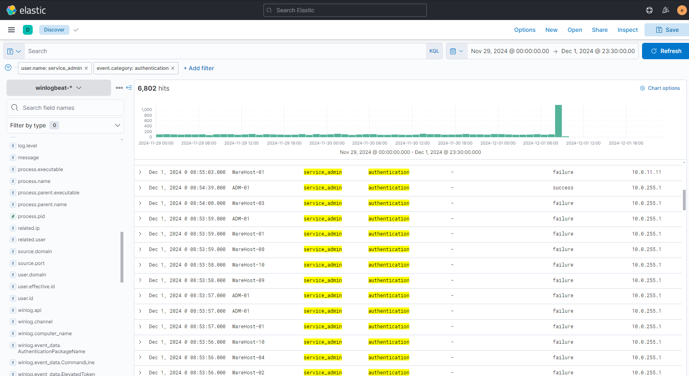

# Day 2: One man's false positive is another man's potpourri.

## Background story
> The below is copied from the day 2 description.

It’s the most wonderful time of the year again, and it’s also the most stressful day for Wareville’s Security Operations Center (SOC) team. Despite the overwhelming alerts generated by the new and noisy rules deployed, Wareville’s SOC analysts have been processing them nonstop to ensure the safety of the town.

However, the SOC analysts are now burning out of all the workload needed before Christmas. Numerous open cases are still pending, and similar alerts are still firing repeatedly, making them think of the possibility of false positives out of all this mess.

Now, help the awesome Wareville’s SOC team analyse the alerts to determine whether the rumour is true—that Mayor Malware is instigating chaos within the town.

> Note: This day's challenge is pretty guided, and so at lot of the information below is my actions following the guidance.

## True positives or false positives?
The challenge gives a description of what true positives and a false positives are. It also gives a brief explanation of what the SOC team is looking for in the alerts.

I'm not going to copy the entire description here, but it's a good read if you're not familiar with the terms.

## Is this a TP or an FP?
The challenge requires you to start up a VM and connect to the Elastic SIEM (Security Information and Event Management) system to investigate the alerts.

Once the machine is started, the challenge replaces the connection details in the text with the actual details so you can just click on the link to connect.

After clicking on the link, and logging in (details on the challenge page) we see the Elastic SIEM homepage:


We can use the menu at the top left to navigate to the Discover page.

When initially going to the Discover page, the time is set to the last 15 minutes. We need to change this to the 1st December 2024 between 0900 and 0930. This can be done by clicking on the time range at the top right and selecting the custom time range.

Now we see 21 events that have happened in that time range:



On the left is a set of column names you can add to the table to make the events easier to read. The challenge suggests addomh the `host.hostname`, `user.name`, `event.category`, `process.command_line` and `event.outcome` columns.

The output looks like this:



We can see that there are a few events that run a PowerShell command on differemt machines, and that each of these was run by the `service_admin` user. We can also see that right before the PowerShell command is run, an authentication event is logged for the `service_admin` user.

It is suspicious that the time between the authentication event and the PowerShell command is the same for each machine.

It is also suspicious that the generic `service_admin` user is being used to run the PowerShell command, as the company has a policy of using unique usernames for each user for admin tasks.

The challenge tells us that the account is used by two people who were not in the office at the time of the events.

We also add the `source.ip` address to the table to see where the events are coming from.

As the source IP is only available for the authentication events, we can filter out the process events by hovering over the `authentication` in the event category column and clicking on the `+` icon. This will filter the table to only show authentication events:



As for the previous time range we were searching for the PowerShell events, it's possibly the authentication events cam efrom before that. It is suggected we remove our filter (by clicking the `x` next to the filter at the top left) and change the time range to the 29th November 2024 00:00 to the 1st December 23:30.

We can now see that there were a massive 6814 events in the 3 day time range, with a spike on the 1st December:



Now it's suggested with filter for the `service_admin` user and the IP address of `10.0.11.11` to narrow the search.

This give us 5702 `authentication` events.

Lets see if any other IP addresses have been used to authenticate as `service_admin`. We can do this by adding the `authentication` filter back, and to filter out the `10.0.11.11` IP address. We can filter something out by clicking the `-` next to one of the entries in the `source.ip` column.

After applying the filters, we get 1100 events, and we can see that the event spike on the 1st December is due to the IP address 10.0.255.1


We are told that investigators found that the attempts to login from 10.0.11.11 was due to a script that had expired credentials. If we remove the source IP the filter, we can see that, looking at the 1st December around 09:00, after a series of failed logins, the `service_admin` user successfully logs in:



However, we can also see that from the IP address 10.0.255.1, there were a log of failed logins, and then a successful login. This suggest that there may have been a brute force attack on the `service_admin` account, which ended in a successful login:



This looks like a true positive, as the `service_admin` account was successfully logged into from that IP address, and then the PowerShell command was quickly run on the compromised machines.

## Christmas in Danger?
Now that we have found what seems to be a true positive, we can look at the PowerShell command to see what it was doing.

We clear the other filters and add the `event category` filter for `process`.

The command is:

```plaintext
"C:\Windows\System32\WindowsPowerShell\v1.0\powershell.exe" -EncodedCommand SQBuAHMAdABhAGwAbAAtAFcAaQBuAGQAbwB3AHMAVQBwAGQAYQB0AGUAIAAtAEEAYwBjAGUAcAB0AEEAbABsACAALQBBAHUAdABvAFIAZQBiAG8AbwB0AA==
```

This is a base64 encoded command (that is the usual encoding for the `EncodedCommand` option) and we can decode this using [CyberChef](https://gchq.github.io/CyberChef/).

We put the encoded command (starting with `SQ` and ending with `AA==`) into the input box, and add the `From Base64` operation, and also the `Decode text` operation, setting the encoding to `UTF-16LE (1200)`. This gives us the following PowerShell command:

```plaintext
Install-WindowsUpdate -AcceptAll -AutoReboot
```

This is surprising - it seemed that someone brute forced the `service_admin` account to install Windows updates on the machines. This is a false positive, as the PowerShell command was not malicious.

It turned out it was Glitch's IP address that did this update!

## Answes to the questions
> Note: This section contains the answers to the questions asked in the challenge. If you don't want spoilers, don't read this section.

### What was the name of the account causing all the failed login attempts?
The full question is: `What was the name of the account causing all the failed login attempts?`

This answer is obvious from the investigation - the account was `service_admin`.

### How many failed login attepmts were observed?
The full question is: `How many failed login attepmts were observed?`

For this we need to go back to Elastic, and filter on `authentication` and `failure`. There were 6791 failed login attempts.

### What was the IP address of Glitch?
The full question is: `What was the IP address of Glitch?`

Given that we know Glitch was the one who installed the Windows updates, we can see that the IP address was `10.0.255.1`.

### When did Glitch successfully logon to ADM-01?
The full question is: `When did Glitch successfully logon to ADM-01? Format: MMM D, YYYY HH:MM:SS.SSS`

We can see from the Elastic logs that Glitch successfully logged in at `Dec 1, 2024 08:54:39.000`.

### What is the decoded command executed by Glitch?
The full question is: `What is the decoded command executed by Glitch to fix the systems of Wareville?`

The decoded command we saw in CyberChef was `Install-WindowsUpdate -AcceptAll -AutoReboot`.

### Remaining questions
The remaining questions only require you to click `Complete` and have no specific answers to find.