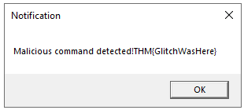

# Day 6: If I can't find a nice malware to use, I'm not going.

## Background story
> The below is copied from the day 6 description.

*Mayor Malware was scheming, quite full of delight,*<br>
*To ruin SOC-mas and frighten SOC teams.*<br>
*But Glitch and McSkidy had spoiled his plan,*<br>
*By uncovering secrets that exposed the man!*<br>

Mayor Malware slammed his hand on the table, his eyes narrowing as the report flashed on his screen. Glitch and McSkidy had uncovered his trail. He took a deep breath, calming himself. "No matter," he muttered, a sinister grin forming. "They may have found me but haven't stopped me." His confidence stemmed from the malware he had crafted—so devious and advanced that it would easily evade detection.

But before unleashing it to wreak havoc on SOC teams and ruin SOC-mas, there was one final step. He needed to test it in a sandbox.

He slipped his malware into a sandbox to see,
What tricks it could play and what flaws there might be.
For sandboxes, you see, are used by the wise,
Defenders inspect, but attackers revise!

## Learning objectives
- Analyze malware behaviour using sandbox tools.
- Explore how to use YARA rules to detect malicious patterns.
- Learn about various malware evasion techniques.
- Implement an evasion technique to bypass YARA rule detection.

## Connecting to the machine
The machine used is a Windows machine, so we can use it in the split screen mode that TryHackMe provides, or we can use RDP to connect to the machine. The challenge page provides the RDP credentials. 

## Detecting Sandboxes
The challenge explains that you can use the registry to detect if the malware is running in a sandbox. The registry key `HKEY_LOCAL_MACHINE\SOFTWARE\Microsoft\Windows\CurrentVersion` contains a value `ProgamFilesDir` that is usually `C:\Program Files`. If the malware is running in a sandbox, this value will often be absent.

The challenge also supplies the following C code snippet that can be used to check for the registry key:
```c
void registryCheck() {
    const char *registryPath = "HKLM\\Software\\Microsoft\\Windows\\CurrentVersion";
    const char *valueName = "ProgramFilesDir";
    
    // Prepare the command string for reg.exe
    char command[512];
    snprintf(command, sizeof(command), "reg query \"%s\" /v %s", registryPath, valueName);
    // Run the command
    int result = system(command);
    // Check for successful execution
    if (result == 0) {
        printf("Registry query executed successfully.\n");
    } else {
        fprintf(stderr, "Failed to execute registry query.\n");
    }
}
int main() {
    const char *flag = "[REDACTED]";
    registryCheck();
        return 0;

} 
```

## Can YARA do it?
YARA is a tool used to identify and classify malware samples. The challenge provides a YARA rule:
```
rule SANDBOXDETECTED
{
    meta:
        description = "Detects the sandbox by querying the registry key for Program Path"
        author = "TryHackMe"
        date = "2024-10-08"
        version = "1.1"

    strings:
        
    $cmd= "Software\\Microsoft\\Windows\\CurrentVersion\" /v ProgramFilesDir" nocase

    

    condition:
        $cmd
}
```
The description in the challege text says that the YARA rule would detect malware trying to test if it's running in a sandbox, but the meta data in the YARA rule says it detects the sandbox by making the query to the registry key. This is confusing, but the YARA rule will actually look for the string `Software\\Microsoft\\Windows\\CurrentVersion\" /v ProgramFilesDir` in the Event Logs.

To monitor the event logs, a script has been set up to check the event log using the YARA rule. The script is in `C:\Tools` on the machine we started up for the challenge. The script is called `JingleBells.ps1`.

Run the script in a Powershell window, and it will sit and wait to detect the YARA rule in the event logs:


Now we can run the malware to see if it's detected by the YARA rule. The malware is in `C:\Tools\Malware` and is called `MerryChristmas.exe`.

Double click on the `MerryChristmas.exe` to run it. The script will detect the YARA rule in the event logs:


The script also popped up a message box, but this contained a flag, so I'll only show that in the Question section.

Now we can press `Ctrl+C` in the Powershell window to stop the script.

## Adding More Evasion Techniques
So YARA detected the malware, but we the Mayor decided to add obfuscation to the malware to evade detection. The challenge provides teh revised malware C code:
```c
void registryCheck() {
// Encoded PowerShell command to query the registry
    const char *encodedCommand = "RwBlAHQALQBJAHQAZQBtAFAAcgBvAHAAZQByAHQAeQAgAC0AUABhAHQAaAAgACIASABLAEwATQA6AFwAUwBvAGYAdAB3AGEAcgBlAFwATQBpAGMAcgBvAHMAbwBmAHQAXABXAGkAbgBkAG8AdwBzAFwAQwB1AHIAcgBlAG4AdABWAGUAcgBzAGkAbwBuACIAIAAtAE4AYQBtAGUAIABQAHIAbwBnAHIAYQBtAEYAaQBsAGUAcwBEAGkAcgA=";
    // Prepare the PowerShell execution command
    char command[512];
    snprintf(command, sizeof(command), "powershell -EncodedCommand %s", encodedCommand);

    // Run the command
    int result = system(command);

    // Check for successful execution
    if (result == 0) {
        printf("Registry query executed successfully.\n");
    } else {
        fprintf(stderr, "Failed to execute registry query.\n");
    }  
}
```

The encoded command is a PowerShell command that queries the registry. We could look at this in CyberChef, using Base64 to decode it. The decoded command is:
```powershell
Get-ItemProperty -Path "HKLM:\Software\Microsoft\Windows\CurrentVersion" -Name ProgramFilesDir
```

## Beware of Floss
We can use Floss to deobfuscate the malware executable. Floss is a tool that extracts strings from obfuscated code. We can run Floss on the malware executable with the following Powershell command:
```powershell 
floss.exe C:\Tools\Malware\MerryChristmas.exe | Out-File C:\Tools\Malware\malstrings.txt
```

The command can take a couple of minutes, but the resulting strings will be saved in `C:\Tools\Malware\malstrings.txt`. We can open this file to see the deobfuscated strings.

The file is quite long, but we're told that the flag is in the file. We can search for the flag using the following Powershell command:
```powershell
Select-String -Path C:\Tools\Malware\malstrings.txt -Pattern "THM{"
```

## Using YARA Rules on Sysmon Logs
The challenge explains how to monitor the Sysmon logs with a YARA rule. I'm not going to repeat the instructions here (we already have the flags we need - this is extra info), but it's worth reading through the challenge.

## Never Gonna Give Up
> The challenge finishes with the text below. This is copied from the day 6 challenge.

*His malware, it seemed, wasn't quite ready for town.*<br>
*"There are watchers and scanners and rules by the ton!*<br>
*If I'm not careful, they'll catch all my fun!"*<br>

Mayor Malware leaned back, tapping his fingers thoughtfully on the table. All of this research had revealed an unsettling truth: his malware, as cunning as it was, wasn't yet ready for the wild. There were too many tools and too many vigilant eyes—analysts armed with YARA rules, Sysmon, and a host of detection techniques that could expose his creation before it even had a chance to spread.

He clenched his fist, a determined glint in his eye. "Just a little more fine-tuning," he murmured. He would study, adapt, and evolve his malware until it was truly undetectable. When the time was right, he would unleash it upon the unsuspecting SOC teams, striking when they least expected it.

But for now, he would wait. Watching. Planning. And he was perfecting his craft in the shadows.

## Answes to the questions
> Note: This section contains the answers to the questions asked in the challenge. If you don't want spoilers, don't read this section.

### What is the flag displayed in the popup window?
The full question is: `What is the flag displayed in the popup window after the EDR detects the malware?`.

The dialog that popped up is:



So the flag is `THM{GlitchWasHere}`.

### What is the flag found in the malstrings.txt document?
The full question is: `What is the flag found in the malstrings.txt document after running floss.exe, and opening the file in a text editor?`.

I didn't actually open the file in a text editor, but I did run the `Select-String` command to find the flag. The flag is `THM{HiddenClue}`:
```powershell
> Select-String -Path C:\Tools\Malware\malstrings.txt -Pattern "THM{"

malstrings.txt:423:THM{HiddenClue}
```

### Remaining questions
The remaining questions only require you to click `Complete` and have no specific answers to find.